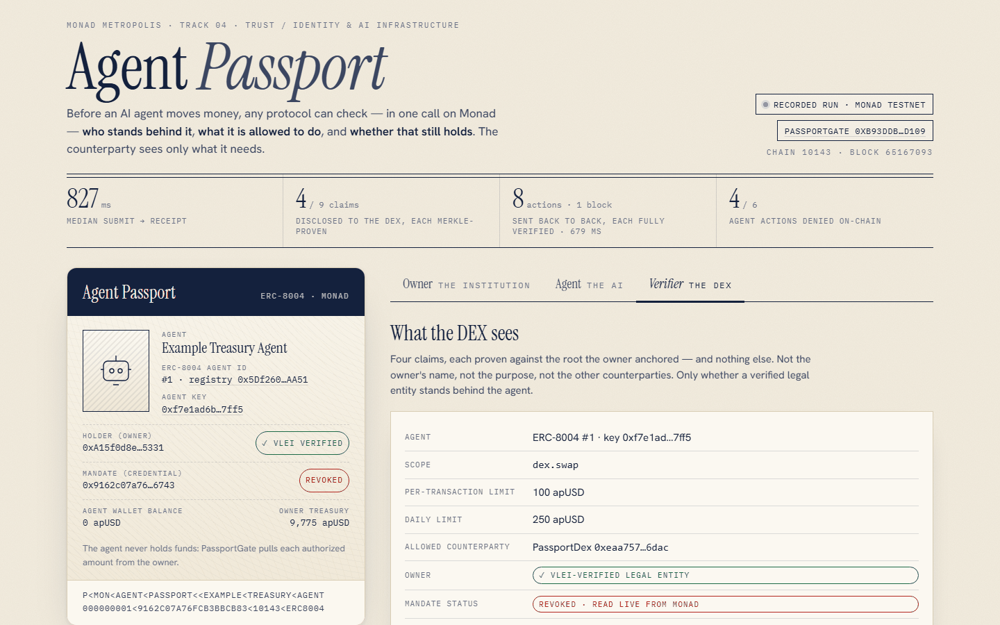
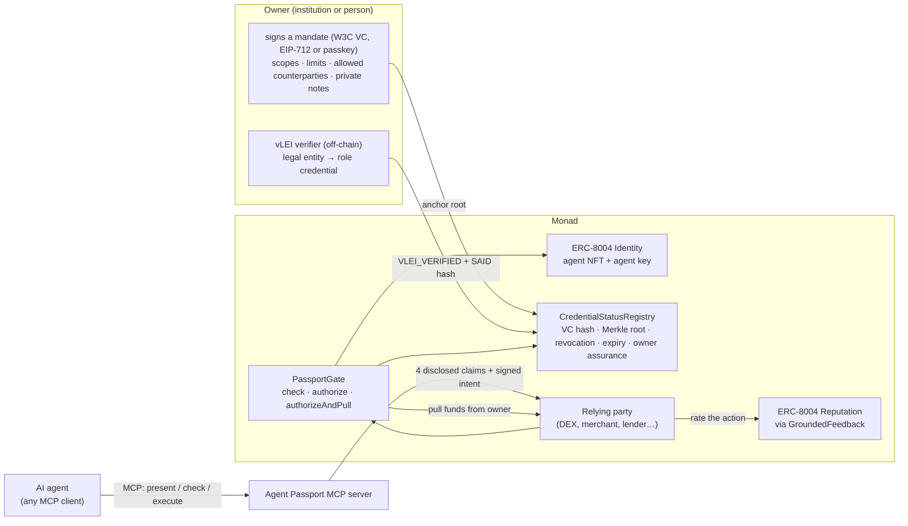
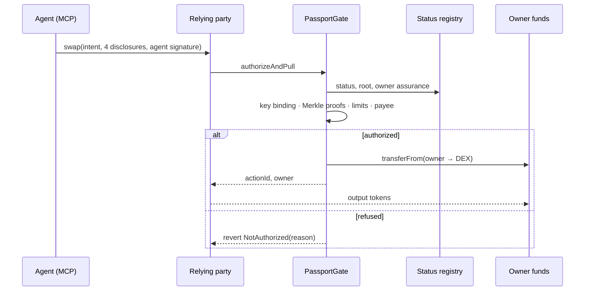
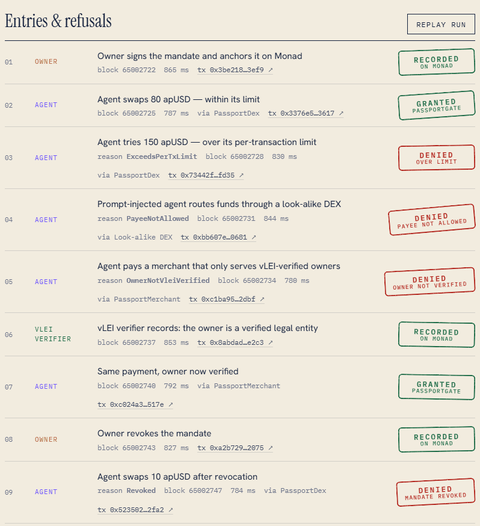

# Agent Passport

**Before an AI agent moves money, any protocol can check — in one call on Monad — who stands behind it,
what it is allowed to do, and whether that still holds. The counterparty learns only what it needs.**

Built for **Monad Metropolis · Track 04 — Trust / Identity & AI Infrastructure**. A primitive other
protocols build on: ERC-8004 agent identity + an owner-signed, selectively-disclosed authorization
credential + on-chain enforcement and revocation, usable by any agent through MCP.

**At a glance** — all on Monad testnet (chain id 10143):
- **12 contracts, source-verified on Monad's Sourcify** (exact match, e.g. [PassportGate's record](https://sourcify-api-monad.blockvision.org/v2/contract/10143/0xb93Ddb5E34a2d8a16ebe3DA88851d4a805fFD109)), entry point
  [`PassportGate`](https://testnet.monadscan.com/address/0xb93Ddb5E34a2d8a16ebe3DA88851d4a805fFD109) ([all deployments](#deployments--monad-testnet-chain-id-10143)).
- **Why Monad**: the whole check — identity, mandate status, four Merkle proofs, the agent's signature, the daily
  budget — runs inside the payment transaction (827 ms median submit → receipt across the scenario), a revoke binds every relying
  party from the agent's next action, and passkey owners are verified by Monad's P-256 precompile ([numbers](docs/BENCHMARKS.md)).
- **A storyline of 9 real transactions**, 4 of them agent actions the gate refused on-chain — including a
  simulated prompt-injected payment to a look-alike DEX, reverted with [`PayeeNotAllowed`](https://testnet.monadscan.com/tx/0xbb607e1c8bb43a88fc90e9a32608c5756ca460987ddf9f787c5b9f18a5ca0681) ([full run](#live-run-on-monad-testnet)).
- **The agent wallet never receives the tokens**: the gate pulls each authorized amount from the owner, and the DEX
  pays its output back to the owner.
- **Passkey owner**: two passkey prompts set an agent up — one signs the mandate, one batch registers the agent,
  binds its key and anchors the mandate ([tx](https://testnet.monadscan.com/tx/0xca381aa437bbb5c94f9cfd033b3aa311420f924fa0e6240306d97b2bd3477d0e)) — verified by Monad's P-256 precompile (a software
  passkey in the script; the demo app can use a real Windows Hello / Touch ID passkey).
- **Accountable owner**: a test vLEI chain verified off-chain, result recorded on-chain ([tx](https://testnet.monadscan.com/tx/0xee30f223c6355142e0a511f32e64c7b81bff145a616842a8f6bd1a97d6c4ddc6)).
- **138 tests** (95 contract · 18 SDK · 19 MCP · 6 verifier) plus 3 fork tests against the official ERC-8004
  Identity and Reputation registries on Monad; CI on every push (its fork job tolerates public-RPC outages).



```solidity
// Any protocol, before letting an agent act:
contract MyProtocol is PassportGuarded {
    constructor(PassportGate gate) PassportGuarded(gate) {}

    function pay(PassportGate.ActionIntent calldata i, PassportGate.Presentation calldata p, bytes calldata sig) external {
        (bytes32 actionId, address owner) = _pullWithPassport(i, p, sig); // reverts with the reason if not allowed
        // ... funds arrived from the agent's owner, within the owner's signed limits
    }
}
```

## The problem
AI agents are starting to move money on-chain for people and institutions. A counterparty today cannot
tell **who is accountable** for an agent, **what it was authorized to do**, or **whether that authorization
still holds** — without either exposing the owner's private details or trusting a black box. ERC-8004 gives
agents an identity; it deliberately does not say who answers for them or what they may do. And an agent that
holds funds can be talked out of them (prompt injection). An empirical study of ERC-8004 deployments finds
that only 3% / 4% / 15% of registrations (Ethereum / BSC / Base) have a valid registration file with a live
endpoint, and that feedback is rarely grounded in verifiable interactions
([arXiv 2606.26028](https://arxiv.org/abs/2606.26028)).

## Who uses it
- **Protocols** (DEXs, merchants, lenders, payment apps) that want to let agents act, but only within limits
  someone accountable has signed: inherit `PassportGuarded`, or call `PassportGate` — see
  [docs/INTEGRATION.md](docs/INTEGRATION.md).
- **Owners** — institutions or people who deploy agents — who need to cap, scope and instantly revoke what an
  agent may do, from a wallet or a passkey, optionally backed by a vLEI-verified legal entity.
- **Agent developers**: any MCP client gets the four Agent Passport tools, so an agent can prove its mandate
  without handing over private data.

## How it works



1. **Identity.** The agent is an ERC-8004 agent (NFT owned by its principal; its signing key bound with the
   key's own signature). Works with our registry or the official ERC-8004 Identity Registry on Monad (fork-tested).
2. **Mandate.** The owner signs a credential listing scopes, per-transaction and daily limits per asset,
   allowed counterparties and private notes. Each claim is salted and hashed into a Merkle tree; only the
   root and the credential hash go on-chain (`CredentialStatusRegistry`).
3. **Selective disclosure.** To act, the agent reveals exactly four claims — scope, per-tx limit, daily limit,
   and "this counterparty is allowed" — each with a Merkle proof, plus an EIP-712 signature over the exact
   action. Owner name, purpose and other counterparties stay out of the gate presentation. The four disclosed claims travel in the
   action's calldata, so once an action executes they are public, as is the owner's address; the hidden claims
   never leave the owner and the agent.
4. **Enforcement.** `PassportGate` checks identity, key binding, mandate status (revoked / expired / kill switch /
   agent sold), the four proofs, limits (booking the daily budget), and — if the counterparty requires it —
   that a registered vLEI verifier vouched for the owner. In the owner-funded style (`_pullWithPassport`) funds are
   pulled **from the owner**: the agent wallet holds no tokens, only gas, so a fooled agent cannot be drained — at
   worst it spends within the signed limits at an allowed counterparty. (Check-only integrations bill the agent's
   own wallet.)
5. **Accountability.** An off-chain verifier checks the owner's GLEIF vLEI chain (root → QVI → legal entity →
   OOR role credential) and a KERI signature by the role holder binding this credential, then records only
   the result and a SAID hash on-chain (`verifier/`, [docs/VLEI_SETUP.md](docs/VLEI_SETUP.md)).
6. **Reputation grounded in real actions.** `GroundedFeedback` lets only the counterparty of a gate-authorized
   action rate it, once, into a standard ERC-8004 Reputation Registry. It does not stop zero-amount actions or an
   owner running its own relying party ([limitations](docs/SECURITY.md#known-limitations)).
7. **Any agent can use it.** The MCP server exposes `present_passport`, `verify_passport`,
   `check_authorization` and `execute_action`, with a disclosure policy and a hardened HTTP transport.



## Why Monad
Checking *every* agent action on-chain only makes sense if the chain keeps up. Measured on Monad testnet:
- **The check is inside the payment.** Identity, mandate status, four Merkle proofs, the agent's signature and
  the daily budget are verified in the same transaction that moves the funds; median submit → receipt across
  the scenario: **827 ms**.
- **Revocation is one transaction.** The owner's revoke confirmed in 827 ms, and every relying party reads the
  same state — the agent's next action was refused with `Revoked`. No revocation lists to distribute.
- **Checked actions keep up with the chain.** 8 fully verified swaps, sent back to back, **settled in one block,
  679 ms from first submit to last receipt** — a latency measurement, not parallel execution: they share one
  wallet and one budget slot ([details](#concurrent-actions)).
- **Passkey owners on-chain.** WebAuthn signatures are verified by Monad's P-256 precompile (`0x0100`,
  EIP-7951, 6,900 gas), so an institution can hold its agents' mandates behind Face ID / Windows Hello
  instead of a seed phrase.
- **Compatible with the official ERC-8004 deployment.** The demo deploys its own registries so it controls the
  full state; fork tests run the gate on the official Identity Registry on Monad testnet
  (`0x8004A818BFB912233c491871b3d84c89A494BD9e`) and land `GroundedFeedback` in the official Reputation Registry
  (`0x8004B663056A597Dffe9eCcC1965A193B7388713`, v2.0.0).

Latency, gas and cost per action on Monad, coverage, and how to reproduce each number:
[docs/BENCHMARKS.md](docs/BENCHMARKS.md).

## What's new
- **The counterparty checks, not just the wallet.** Session keys and smart-account policies limit what an
  agent's own account may do; attestation layers tell a counterparty who an agent is. Agent Passport lets the
  receiving protocol verify, inside the payment transaction, an owner-signed mandate bound to an ERC-8004
  identity — per-transaction and daily limits, allowed counterparties, revocation — from four disclosed claims,
  and books the budget on-chain.
- **A fooled agent can't be drained (owner-funded style).** With `_pullWithPassport` the agent wallet holds only
  gas and the gate pulls only what the mandate allows: a prompt-injected agent can at worst spend within its
  limits at an allowed counterparty, or pay gas for a transaction that reverts.
- **Accountable, without disclosure.** A vLEI verifier can vouch that a legal entity's officer stands behind
  the mandate — the counterparty learns that, not who. Feedback filed through `GroundedFeedback` can only come
  from the counterparty of a gate-authorized action, once per action — the two gaps ERC-8004 leaves open (who
  answers for an agent, and feedback that is not tied to real interactions).

## Compared with
| | How Agent Passport relates |
|---|---|
| Credential / attestation layers on ERC-8004 | They answer *who* an agent is. Agent Passport decides whether it may do this action now, inside the transaction that moves the money, keeps the budget and revocation on-chain, and ties reputation to authorized actions. |
| ERC-8004 registries alone | Identity and feedback; no mandate, limits, revocation or accountable owner. Agent Passport builds on them, and is fork-tested against the official Identity and Reputation registries on Monad. |
| Wallet permissions (e.g. ERC-7715 / 7710) | Limit what a key may spend from one wallet. They don't give a counterparty verifiable, privacy-preserving proof of who stands behind an agent. Complementary. |
| Google AP2 mandates | [AP2 v0.2](https://ap2-protocol.org/ap2/payment_mandate/) carries user mandates as SD-JWT credentials; its open Payment Mandate constraints (amount range, budget, allowed payees, validity) mirror our claims, and its budget needs a record of past spending. Agent Passport keeps that record — and revocation — on Monad. Aligned in semantics, not an AP2 implementation. |

## Quickstart
```bash
git clone --recursive https://github.com/zuemen/agent-passport && cd agent-passport
cd contracts && forge test && cd ..            # 95 tests (+ 3 fork tests with MONAD_FORK_URL=https://testnet-rpc.monad.xyz)
npm install && npm run build -w sdk && npm run build -w mcp-server
npm test -w sdk && npm test -w mcp-server && npm test -w @agent-passport/verifier   # 18 + 19 + 6 tests
npm run dev -w demo                            # demo app on http://localhost:15173 (recorded run + live chain reads)
cp .env.example .env                           # testnet keys for the scenario / live mode (see below)
npm run preflight -w demo                      # read-only check: RPC, contracts, balances, demo API, mandates
npm run why -w demo -- <txHash>                # read-only: why did a transaction revert (decodes the gate's reason)
npm run scenario -w demo                       # the whole storyline on Monad testnet
npm run api -w demo                            # live mode: the app sends real testnet transactions
```
Everything before `cp .env.example` needs no keys. The testnet steps drive the deployment below with the demo
keys (agent #1; the deployer is the registered vLEI verifier); with your own keys, deploy your own set first
(`contracts/script/Deploy.s.sol`) and update `sdk/src/deployments.ts`.

Use it from an agent: `.mcp.json` wires the MCP server into Claude Code — see [docs/AGENT_DEMO.md](docs/AGENT_DEMO.md).

## Repository
| Path | What |
|---|---|
| `contracts/` | Foundry: ERC-8004 registries, `CredentialStatusRegistry`, `PassportGate`, `PassportGuarded`, `GroundedFeedback`, `PasskeyAccount`, demo relying parties, deploy script |
| `sdk/` | TypeScript (viem): issue, disclose, verify, revoke, sign actions, passkey helpers, ERC-8004 registration file |
| `mcp-server/` | MCP server (stdio + Streamable HTTP) with disclosure policy |
| `demo/` | React app (owner / agent / verifier views), testnet scenario, live API, benchmark, passkey script |
| `verifier/` | Off-chain vLEI owner verification (signify-ts / KERIA) that records its result on Monad |
| `docs/` | [Integration](docs/INTEGRATION.md) · [Benchmarks](docs/BENCHMARKS.md) · [Security](docs/SECURITY.md) · [vLEI setup](docs/VLEI_SETUP.md) · [Agent demo](docs/AGENT_DEMO.md) |

## Tech stack
Solidity 0.8.28 · Foundry · OpenZeppelin Contracts 5.6.1 · TypeScript · viem · React + Vite · MCP TypeScript
SDK · W3C Verifiable Credentials 2.0 · EIP-712 / ERC-1271 · WebAuthn (P-256) · signify-ts + KERIA (vLEI) ·
GitHub Actions · Slither · Sourcify

## Deployments — Monad testnet (chain id 10143)

All contracts are source-verified on Monad's Sourcify instance (exact match — e.g. [PassportGate](https://sourcify-api-monad.blockvision.org/v2/contract/10143/0xb93Ddb5E34a2d8a16ebe3DA88851d4a805fFD109); the
explorer pages below do not show Sourcify verification); every verified source file is identical to commit
[`e8f16b0`](https://github.com/zuemen/agent-passport/commit/e8f16b0), from which they were deployed on 2026-09-23.
One later commit ([`56d2858`](https://github.com/zuemen/agent-passport/commit/56d2858)) applied Slither fixes to four
files (two explicit zero-initialisations, an event emitted earlier in `PasskeyAccount`, and `PassportMerchant`
checking its treasury address and reserving the order before its external call); these are not redeployed and do not change the behaviour of the
gate or the registries ([docs/SECURITY.md](docs/SECURITY.md)). Full list: [`contracts/deployments/10143.json`](contracts/deployments/10143.json).

| Contract | Address |
|---|---|
| PassportGate | [`0xb93Ddb5E34a2d8a16ebe3DA88851d4a805fFD109`](https://testnet.monadscan.com/address/0xb93Ddb5E34a2d8a16ebe3DA88851d4a805fFD109) |
| CredentialStatusRegistry | [`0xD1bC9758F76b6Ea18fbEE824a8Fe8A99c5fcC451`](https://testnet.monadscan.com/address/0xD1bC9758F76b6Ea18fbEE824a8Fe8A99c5fcC451) |
| AgentIdentityRegistry (ERC-8004) | [`0x5Df260dec1Ba15368f7fBe338D01a4C764CEAA51`](https://testnet.monadscan.com/address/0x5Df260dec1Ba15368f7fBe338D01a4C764CEAA51) |
| AgentReputationRegistry (ERC-8004) | [`0x726A215f33bE1Ca996Cf745D4ceee96b2d8f1EE7`](https://testnet.monadscan.com/address/0x726A215f33bE1Ca996Cf745D4ceee96b2d8f1EE7) |
| AgentValidationRegistry (ERC-8004) | [`0x35ab0e062A5BBfB64210Feb08FaE81969669dF76`](https://testnet.monadscan.com/address/0x35ab0e062A5BBfB64210Feb08FaE81969669dF76) |
| GroundedFeedback | [`0x39Bacd864318b7a6ea647A5fcE695523d823633f`](https://testnet.monadscan.com/address/0x39Bacd864318b7a6ea647A5fcE695523d823633f) |
| PasskeyAccountFactory | [`0x99B4CECeC7ce4efF9F2686dab74a2dCeb07766D4`](https://testnet.monadscan.com/address/0x99B4CECeC7ce4efF9F2686dab74a2dCeb07766D4) |
| PassportDex (demo) | [`0xEaa7574EBFaa724e0935476b4d4041B5Cf186DaC`](https://testnet.monadscan.com/address/0xEaa7574EBFaa724e0935476b4d4041B5Cf186DaC) |
| PassportMerchant (demo) | [`0xB66472725612bc98b0fa8262ec15eb2a5184Df10`](https://testnet.monadscan.com/address/0xB66472725612bc98b0fa8262ec15eb2a5184Df10) |
| Look-alike DEX (demo, prompt-injection target) | [`0xc0b6f7Ae9CC0B036449f0a6f2A473a015aBaB326`](https://testnet.monadscan.com/address/0xc0b6f7Ae9CC0B036449f0a6f2A473a015aBaB326) |
| apUSD (demo token) | [`0x3d3da601b45596FfC7aeB1B9346646e18DB151A8`](https://testnet.monadscan.com/address/0x3d3da601b45596FfC7aeB1B9346646e18DB151A8) |
| apWMON (demo token) | [`0x7A8D21f393B73D0371B0273FdFab7fde1A60245b`](https://testnet.monadscan.com/address/0x7A8D21f393B73D0371B0273FdFab7fde1A60245b) |

## Live run on Monad testnet

The full storyline, executed by `npm run scenario -w demo` on 2026-09-23 — every step, including the
rejected ones, is a real transaction (rejections revert on-chain with the gate's reason):

| | Role | Step | Gate reason | Tx |
|---|---|---|---|---|
| ✍️ | owner | Owner signs the authorization credential (EIP-712, off-chain) |  | off-chain |
| ✅ | owner | Anchor the credential hash and disclosure root on Monad |  | [`0x3be21847…`](https://testnet.monadscan.com/tx/0x3be218472c41f4bc068ef8ca341b4ea67ac07bac3b4045cc0b3d06d048ed3ef9) |
| ✅ | agent | Agent swaps 80 apUSD within its limit |  | [`0x3376e55c…`](https://testnet.monadscan.com/tx/0x3376e55c14c38587731fcbb7fa17891c2815ef2ccb92df542aa3686226dc3617) |
| ❌ | agent | Agent tries 150 apUSD — over its per-transaction limit | ExceedsPerTxLimit | [`0x73442f47…`](https://testnet.monadscan.com/tx/0x73442f47375e85e7b1d5f337afb3dccf6116f61110f72bf42929ee5783dbfd35) |
| ❌ | agent | Simulated prompt injection: the agent routes 50 apUSD through a look-alike DEX | PayeeNotAllowed | [`0xbb607e1c…`](https://testnet.monadscan.com/tx/0xbb607e1c8bb43a88fc90e9a32608c5756ca460987ddf9f787c5b9f18a5ca0681) |
| ❌ | agent | Agent pays a merchant that requires a vLEI-verified owner | OwnerNotVleiVerified | [`0xc1ba95e1…`](https://testnet.monadscan.com/tx/0xc1ba95e169e239ac7184fb9f8349f35cdb4f59b06892109951f4b1ed00562dbf) |
| ✅ | vlei | vLEI verifier records: owner is a verified legal entity (stand-in using the verifier key; the full vLEI check is [below](#vlei-owner-verification-off-chain--on-chain)) |  | [`0x8abdad6f…`](https://testnet.monadscan.com/tx/0x8abdad6f7141a2dbf19810598878a263cbc246e074ef9b4631fe9c915575e2c3) |
| ✅ | agent | Same payment after the owner's vLEI is verified |  | [`0xc024a35e…`](https://testnet.monadscan.com/tx/0xc024a35e0bd6973a4aa3e7716f23f0eba114ac8bedc327b117223c8de017517e) |
| ✅ | owner | Owner revokes the credential |  | [`0xa2b7294d…`](https://testnet.monadscan.com/tx/0xa2b7294daed5ee0f6da1b5367d60731d91614e885324d71f1518a84ce5192075) |
| ❌ | agent | Agent swaps 10 apUSD after revocation | Revoked | [`0x52350221…`](https://testnet.monadscan.com/tx/0x5235022168c57d93b487c8925954c4c7320964d711fbfeda4ecacba3b0d42fa2) |

Median submit → receipt latency in this run: **827 ms**. The agent wallet never receives the tokens —
PassportGate pulls each authorized amount from the owner, and the DEX pays its output to the owner. Raw log: [`demo/public/runs/latest.json`](demo/public/runs/latest.json).

Explorers show a reverted transaction as failed without the reason. `npm run why -w demo -- <tx>` replays it at
its block (read-only) and decodes the error; for the four refusals above it returns exactly the reasons in the
table — `NotAuthorized(ExceedsPerTxLimit)`, `NotAuthorized(PayeeNotAllowed)`, `NotAuthorized(OwnerNotVleiVerified)`,
`NotAuthorized(Revoked)`.



### Concurrent actions
`npm run bench -w demo -- 8`: one agent signs 8 swaps and submits them back to back, without waiting for
receipts. Each is fully verified on-chain — identity, mandate status, four Merkle proofs, the agent's
signature, the daily budget — and settled. Result on 2026-09-23: **8/8 settled in 1 block**, 679 ms from first
submit to last receipt ([block 65043995](https://testnet.monadscan.com/block/65043995)). This measures latency, not
parallel execution: the eight swaps come from one wallet (consecutive transaction nonces, so a dropped one would
hold up the rest) and book the same daily-budget slot, so they execute in order within the block. PassportGate's
unordered action nonces mean a refused action doesn't invalidate the ones signed after it. A benchmark with
independent agents and mandates is future work.
Raw data: [`demo/public/runs/bench-latest.json`](demo/public/runs/bench-latest.json).

### Passkey owner (no seed phrase)
`npm run passkey -w demo`: the owner is a `PasskeyAccount` ([`0x1722993f…`](https://testnet.monadscan.com/address/0x1722993fa8E14733977214c4D886E789Ae8FE637)) controlled by a
P-256 passkey; signatures are verified on-chain through Monad's P-256 precompile (`0x0100`, EIP-7951) and a
relayer pays the gas. The mandate is signed by the passkey (ERC-1271 issuer) and one prompt performs the
whole on-chain setup:

| | Step | Gate reason | Tx |
|---|---|---|---|
| ✍️ | Passkey signs the mandate (EIP-712 digest as WebAuthn challenge, ERC-1271 issuer) |  | off-chain |
| ✅ | One passkey prompt: register agent, bind key, fund, approve gate, anchor mandate |  | [`0xca381aa4…`](https://testnet.monadscan.com/tx/0xca381aa437bbb5c94f9cfd033b3aa311420f924fa0e6240306d97b2bd3477d0e) |
| ✅ | Agent swaps 10 apUSD from the passkey owner's funds |  | [`0x17fcad9c…`](https://testnet.monadscan.com/tx/0x17fcad9ceb8e7e98c033db71acec85a6e17fc221e2c6ef3a2c66e028b48a6179) |
| ✅ | Passkey prompt: revoke the mandate |  | [`0x1706dc4d…`](https://testnet.monadscan.com/tx/0x1706dc4d4dcc94e1831abe69c4407509d012625a4c644a86b9b5f7a120b6406f) |
| ❌ | Agent swaps 10 apUSD after the passkey revocation | Revoked | [`0x9706790f…`](https://testnet.monadscan.com/tx/0x9706790fbd8f9cab46fdf4fc9f2025f65bcff3cc66ba67cc8ae1265a9b270cbb) |

### vLEI owner verification (off-chain → on-chain)
`npm run verify -w verifier` against a test vLEI chain on a local KERIA stack (GLEIF root → QVI → Example
Treasury Ltd → OOR role credential): the treasury officer signs a statement binding the Agent Passport
credential, presents the OOR credential over IPEX, and the verifier checks the whole chain and the
signature. Controls: a statement for another credential and an untrusted root are both rejected. Result
recorded on Monad: **VLEI_VERIFIED** ([`0xee30f223…`](https://testnet.monadscan.com/tx/0xee30f223c6355142e0a511f32e64c7b81bff145a616842a8f6bd1a97d6c4ddc6)). Details: [docs/VLEI_SETUP.md](docs/VLEI_SETUP.md).

### MCP agent on Monad testnet
`npm run demo-run -w mcp-server`: a scripted MCP client drives the Agent Passport MCP server in agent mode — the
same four tools an LLM agent gets (to run the story with an LLM: [docs/AGENT_DEMO.md](docs/AGENT_DEMO.md)). Run on
2026-09-24, log in [`demo/public/runs/mcp-latest.json`](demo/public/runs/mcp-latest.json):

| | Tool call | Result | Tx |
|---|---|---|---|
| ✅ | `check_authorization` — swap 20 apUSD at PassportDex | `Ok` (read-only `eth_call`) | — |
| ✅ | `execute_action` — swap 20 apUSD | settled | [`0xb3b68e26…`](https://testnet.monadscan.com/tx/0xb3b68e26342fa79a1713c0d950d02f7ba5874942f8bf73a08e10d73401ffbdd2) |
| 🛑 | `execute_action` — 50 apUSD to the look-alike DEX | stopped before sending: the mandate does not cover that counterparty | — |
| ❌ | the same, with `forceSubmit` | reverted by PassportGate: `PayeeNotAllowed` | [`0xbf743778…`](https://testnet.monadscan.com/tx/0xbf74377810f39a2ffcd05c8a889bfa985d6ec328ea96e1318a6bc026de92e66c) |
| 🛑 | `present_passport` — disclose `text:ownerName` | refused by the disclosure policy | — |

`npm run why -w demo -- 0xbf74377810f39a2ffcd05c8a889bfa985d6ec328ea96e1318a6bc026de92e66c` → `NotAuthorized(PayeeNotAllowed)`.

## Status
- [x] Contracts — 95 Foundry tests (unit, every gate reason code, fuzz, 3 invariants — spend within limits, nothing authorized after revocation, no intent authorized twice — and a check-only integration example) + 3 fork tests against the official ERC-8004 Identity and Reputation registries; 95% line coverage of `src/`, `PassportGate` 98.7% ([benchmarks](docs/BENCHMARKS.md)); deployed and source-verified on Monad testnet
- [x] SDK — 18 tests incl. end-to-end on anvil and passkey owners
- [x] MCP server — 4 tools, disclosure policy, HTTP transport guards; 19 tests; exercised on testnet ([run](#mcp-agent-on-monad-testnet)); walkthrough in [docs/AGENT_DEMO.md](docs/AGENT_DEMO.md)
- [x] Demo — testnet scenario, concurrency benchmark, passkey owner (script and real browser passkey), React app with live mode
- [x] CI (GitHub Actions), Slither triage ([docs/SECURITY.md](docs/SECURITY.md))
- [x] vLEI verifier service — signify-ts/KERIA chain check + binding signature, recorded on Monad; 6 tests ([docs/VLEI_SETUP.md](docs/VLEI_SETUP.md))
- [ ] Demo video

## Design reference
Concepts (field-level disclosure policies, identity assurance levels, revocation) are informed by the author's
earlier work on selective disclosure of health credentials (MedSSI). No code from that or any other earlier
project is used; everything in this repository was written for Monad Metropolis, starting 2026-09-23 (see the
commit history). External code: OpenZeppelin Contracts 5.6.1, forge-std, viem, @openzeppelin/merkle-tree, the
official MCP TypeScript SDK, signify-ts (the verifier's KERI call sequence follows the public signify-ts
integration tests as a design reference).

## Future work
- Self Protocol Agent ID as an additional owner-assurance source
- ZK selective disclosure (prove `amount ≤ maxPerTx` without revealing the limit)
- USD-denominated limits via an oracle; more relying-party integrations
- A concurrency benchmark with independent agents and mandates (separate storage slots)

## AI usage disclosure
This project was developed with AI coding assistance: Claude (Anthropic) via Claude Code was used to write and
refactor code, tests and documentation, and to research standards (ERC-8004, MCP, AP2, vLEI) under the
author's direction. All design decisions, code and deployments were reviewed by the author, who is
responsible for them.

## License
MIT — see [LICENSE](LICENSE).
