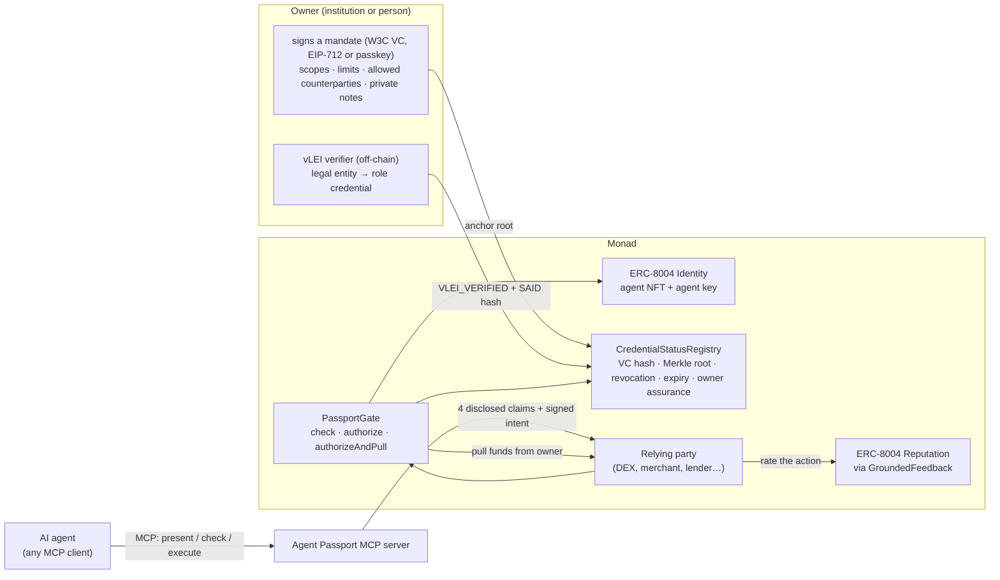
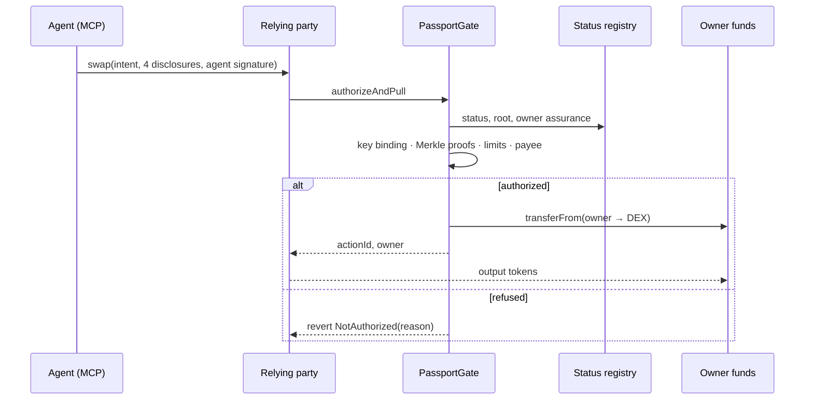

# Agent Passport

**Before an AI agent moves money, any protocol can check — in one call on Monad — who stands behind it,
what it is allowed to do, and whether that still holds. The counterparty learns only what it needs.**

Built for **Monad Metropolis · Track 04 — Trust / Identity & AI Infrastructure**. A primitive other
protocols build on: ERC-8004 agent identity + an owner-signed, selectively-disclosed authorization
credential + on-chain enforcement and revocation, usable by any agent through MCP.

```solidity
// Any protocol, before letting an agent act:
contract MyProtocol is PassportGuarded {
    constructor(PassportGate gate) PassportGuarded(gate) {}

    function pay(PassportGate.ActionIntent calldata i, PassportGate.Presentation calldata p, bytes calldata sig) external {
        (bytes32 actionId, address owner) = _pullWithPassport(i, p, sig); // reverts with the reason if not allowed
        // ... funds arrived from the agent's owner, within the owner's signed limits
    }
}
```

## The problem
AI agents are starting to move money on-chain for people and institutions. A counterparty today cannot
tell **who is accountable** for an agent, **what it was authorized to do**, or **whether that authorization
still holds** — without either exposing the owner's private details or trusting a black box. ERC-8004 gives
agents an identity; it deliberately does not say who answers for them or what they may do. And an agent that
holds funds can be talked out of them (prompt injection).

## How it works



1. **Identity.** The agent is an ERC-8004 agent (NFT owned by its principal; its signing key bound with the
   key's own signature). Works with our registry or the official ERC-8004 deployment on Monad.
2. **Mandate.** The owner signs a credential listing scopes, per-transaction and daily limits per asset,
   allowed counterparties and private notes. Each claim is salted and hashed into a Merkle tree; only the
   root and the credential hash go on-chain (`CredentialStatusRegistry`).
3. **Selective disclosure.** To act, the agent reveals exactly four claims — scope, per-tx limit, daily limit,
   and "this counterparty is allowed" — each with a Merkle proof, plus an EIP-712 signature over the exact
   action. Owner name, purpose and other counterparties stay hidden.
4. **Enforcement.** `PassportGate` checks identity, key binding, mandate status (revoked / expired / kill switch /
   agent sold), the four proofs, limits (booking the daily budget), and — if the counterparty requires it —
   that a registered vLEI verifier vouched for the owner. Funds are pulled **from the owner**; the agent wallet
   never holds any, so a fooled agent has nothing to lose.
5. **Accountability.** An off-chain verifier checks the owner's GLEIF vLEI chain (legal entity → OOR/ECR role
   credential) and records only the result and a SAID hash on-chain (see [docs/VLEI_SETUP.md](docs/VLEI_SETUP.md)).
6. **Reputation that can't be farmed.** `GroundedFeedback` lets only the counterparty of a gate-authorized
   action rate it, once, into a standard ERC-8004 Reputation Registry.
7. **Any agent can use it.** The MCP server exposes `present_passport`, `verify_passport`,
   `check_authorization` and `execute_action`, with a disclosure policy and a hardened HTTP transport.



## Why Monad
Checking *every* agent action on-chain only makes sense if it is fast and cheap. Measured on Monad testnet:
a full verification (identity, status, four Merkle proofs, signature, budget) is part of each swap;
**8 parallel agent actions settled in a single block, 679 ms from first submit to last receipt**, and the
median submit-to-receipt time across the scenario was **827 ms**. The gate's unordered nonces let one agent
run many actions at once instead of queueing. Passkey owners are verified with Monad's P-256 precompile.

## Compared with
| | How Agent Passport relates |
|---|---|
| ERC-8004 registries alone | Identity and feedback; no mandate, limits, revocation or accountable owner. Agent Passport builds on them — and runs on the official deployment (see the fork test). |
| Wallet permissions (e.g. ERC-7715 / 7710) | Limit what a key may spend from one wallet. They don't give a counterparty verifiable, privacy-preserving proof of who stands behind an agent. Complementary. |
| Google AP2 mandates | AP2 v0.2 carries user mandates as SD-JWT credentials; its open Payment Mandate constraints (amount range, budget, allowed payees, validity) mirror our claims, and its budget needs a record of past spending. Agent Passport keeps that record — and revocation — on Monad. Aligned in semantics, not an AP2 implementation. |

## Quickstart
```bash
git clone --recursive https://github.com/zuemen/agent-passport && cd agent-passport
cd contracts && forge test && cd ..            # 87 tests (+ fork test with MONAD_FORK_URL=https://testnet-rpc.monad.xyz)
npm install && npm run build -w sdk && npm test -w sdk && npm test -w mcp-server
npm run dev -w demo                            # demo app on http://localhost:15173 (recorded run + live chain reads)
cp .env.example .env                           # add fresh testnet keys to run the scenario / live mode
npm run scenario -w demo                       # the whole storyline on Monad testnet
npm run api -w demo                            # live mode: the app sends real testnet transactions
```
Use it from an agent: `.mcp.json` wires the MCP server into Claude Code — see [docs/AGENT_DEMO.md](docs/AGENT_DEMO.md).

## Repository
| Path | What |
|---|---|
| `contracts/` | Foundry: ERC-8004 registries, `CredentialStatusRegistry`, `PassportGate`, `PassportGuarded`, `GroundedFeedback`, `PasskeyAccount`, demo relying parties, deploy script |
| `sdk/` | TypeScript (viem): issue, disclose, verify, revoke, sign actions, passkey helpers, ERC-8004 registration file |
| `mcp-server/` | MCP server (stdio + Streamable HTTP) with disclosure policy |
| `demo/` | React app (owner / agent / verifier views), testnet scenario, live API, benchmark, passkey script |
| `docs/` | [Security](docs/SECURITY.md) · [vLEI setup](docs/VLEI_SETUP.md) · [Agent demo](docs/AGENT_DEMO.md) |

## Deployments — Monad testnet (chain id 10143)

All contracts are source-verified (Sourcify, exact match). Full list: [`contracts/deployments/10143.json`](contracts/deployments/10143.json).

| Contract | Address |
|---|---|
| PassportGate | [`0xb93Ddb5E34a2d8a16ebe3DA88851d4a805fFD109`](https://testnet.monadscan.com/address/0xb93Ddb5E34a2d8a16ebe3DA88851d4a805fFD109) |
| CredentialStatusRegistry | [`0xD1bC9758F76b6Ea18fbEE824a8Fe8A99c5fcC451`](https://testnet.monadscan.com/address/0xD1bC9758F76b6Ea18fbEE824a8Fe8A99c5fcC451) |
| AgentIdentityRegistry (ERC-8004) | [`0x5Df260dec1Ba15368f7fBe338D01a4C764CEAA51`](https://testnet.monadscan.com/address/0x5Df260dec1Ba15368f7fBe338D01a4C764CEAA51) |
| AgentReputationRegistry (ERC-8004) | [`0x726A215f33bE1Ca996Cf745D4ceee96b2d8f1EE7`](https://testnet.monadscan.com/address/0x726A215f33bE1Ca996Cf745D4ceee96b2d8f1EE7) |
| AgentValidationRegistry (ERC-8004) | [`0x35ab0e062A5BBfB64210Feb08FaE81969669dF76`](https://testnet.monadscan.com/address/0x35ab0e062A5BBfB64210Feb08FaE81969669dF76) |
| GroundedFeedback | [`0x39Bacd864318b7a6ea647A5fcE695523d823633f`](https://testnet.monadscan.com/address/0x39Bacd864318b7a6ea647A5fcE695523d823633f) |
| PasskeyAccountFactory | [`0x99B4CECeC7ce4efF9F2686dab74a2dCeb07766D4`](https://testnet.monadscan.com/address/0x99B4CECeC7ce4efF9F2686dab74a2dCeb07766D4) |
| PassportDex (demo) | [`0xEaa7574EBFaa724e0935476b4d4041B5Cf186DaC`](https://testnet.monadscan.com/address/0xEaa7574EBFaa724e0935476b4d4041B5Cf186DaC) |
| PassportMerchant (demo) | [`0xB66472725612bc98b0fa8262ec15eb2a5184Df10`](https://testnet.monadscan.com/address/0xB66472725612bc98b0fa8262ec15eb2a5184Df10) |
| apUSD (demo token) | [`0x3d3da601b45596FfC7aeB1B9346646e18DB151A8`](https://testnet.monadscan.com/address/0x3d3da601b45596FfC7aeB1B9346646e18DB151A8) |
| apWMON (demo token) | [`0x7A8D21f393B73D0371B0273FdFab7fde1A60245b`](https://testnet.monadscan.com/address/0x7A8D21f393B73D0371B0273FdFab7fde1A60245b) |

## Live run on Monad testnet

The full storyline, executed by `npm run scenario -w demo` on 2026-09-23 — every step, including the
rejected ones, is a real transaction (rejections revert on-chain with the gate's reason):

| | Role | Step | Gate reason | Tx |
|---|---|---|---|---|
| ✍️ | owner | Owner signs the authorization credential (EIP-712, off-chain) |  | off-chain |
| ✅ | owner | Anchor the credential hash and disclosure root on Monad |  | [`0x3be21847…`](https://testnet.monadscan.com/tx/0x3be218472c41f4bc068ef8ca341b4ea67ac07bac3b4045cc0b3d06d048ed3ef9) |
| ✅ | agent | Agent swaps 80 apUSD within its limit |  | [`0x3376e55c…`](https://testnet.monadscan.com/tx/0x3376e55c14c38587731fcbb7fa17891c2815ef2ccb92df542aa3686226dc3617) |
| ❌ | agent | Agent tries 150 apUSD — over its per-transaction limit | ExceedsPerTxLimit | [`0x73442f47…`](https://testnet.monadscan.com/tx/0x73442f47375e85e7b1d5f337afb3dccf6116f61110f72bf42929ee5783dbfd35) |
| ❌ | agent | Prompt-injected agent routes 50 apUSD through a look-alike DEX | PayeeNotAllowed | [`0xbb607e1c…`](https://testnet.monadscan.com/tx/0xbb607e1c8bb43a88fc90e9a32608c5756ca460987ddf9f787c5b9f18a5ca0681) |
| ❌ | agent | Agent pays a merchant that requires a vLEI-verified owner | OwnerNotVleiVerified | [`0xc1ba95e1…`](https://testnet.monadscan.com/tx/0xc1ba95e169e239ac7184fb9f8349f35cdb4f59b06892109951f4b1ed00562dbf) |
| ✅ | vlei | vLEI verifier records: owner is a verified legal entity |  | [`0x8abdad6f…`](https://testnet.monadscan.com/tx/0x8abdad6f7141a2dbf19810598878a263cbc246e074ef9b4631fe9c915575e2c3) |
| ✅ | agent | Same payment after the owner's vLEI is verified |  | [`0xc024a35e…`](https://testnet.monadscan.com/tx/0xc024a35e0bd6973a4aa3e7716f23f0eba114ac8bedc327b117223c8de017517e) |
| ✅ | owner | Owner revokes the credential |  | [`0xa2b7294d…`](https://testnet.monadscan.com/tx/0xa2b7294daed5ee0f6da1b5367d60731d91614e885324d71f1518a84ce5192075) |
| ❌ | agent | Agent swaps 10 apUSD after revocation | Revoked | [`0x52350221…`](https://testnet.monadscan.com/tx/0x5235022168c57d93b487c8925954c4c7320964d711fbfeda4ecacba3b0d42fa2) |

Median submit → receipt latency in this run: **827 ms**. The agent wallet held 0 apUSD throughout —
PassportGate pulls each authorized amount from the owner. Raw log: [`demo/public/runs/latest.json`](demo/public/runs/latest.json).

### Parallel actions
`npm run bench -w demo -- 8`: one agent submits 8 swaps at once. Each is fully verified on-chain —
identity, mandate status, four Merkle proofs, the agent's signature, the daily budget — and settled.
Result on 2026-09-23: **8/8 settled in 1 block**, 679 ms from first submit to
last receipt ([block 65043995](https://testnet.monadscan.com/block/65043995)). PassportGate's unordered nonces mean an
agent's actions never queue behind each other at the protocol level; this is what makes checking *every*
action practical. Raw data: [`demo/public/runs/bench-latest.json`](demo/public/runs/bench-latest.json).

### Passkey owner (no seed phrase)
`npm run passkey -w demo`: the owner is a `PasskeyAccount` ([`0x1722993f…`](https://testnet.monadscan.com/address/0x1722993fa8E14733977214c4D886E789Ae8FE637)) controlled by a
P-256 passkey; signatures are verified on-chain through Monad's P-256 precompile (`0x0100`, EIP-7951) and a
relayer pays the gas. The mandate is signed by the passkey (ERC-1271 issuer) and one prompt performs the
whole on-chain setup:

| | Step | Gate reason | Tx |
|---|---|---|---|
| ✍️ | Passkey signs the mandate (EIP-712 digest as WebAuthn challenge, ERC-1271 issuer) |  | off-chain |
| ✅ | One passkey prompt: register agent, bind key, fund, approve gate, anchor mandate |  | [`0xca381aa4…`](https://testnet.monadscan.com/tx/0xca381aa437bbb5c94f9cfd033b3aa311420f924fa0e6240306d97b2bd3477d0e) |
| ✅ | Agent swaps 10 apUSD from the passkey owner's funds |  | [`0x17fcad9c…`](https://testnet.monadscan.com/tx/0x17fcad9ceb8e7e98c033db71acec85a6e17fc221e2c6ef3a2c66e028b48a6179) |
| ✅ | Passkey prompt: revoke the mandate |  | [`0x1706dc4d…`](https://testnet.monadscan.com/tx/0x1706dc4d4dcc94e1831abe69c4407509d012625a4c644a86b9b5f7a120b6406f) |
| ❌ | Agent swaps 10 apUSD after the passkey revocation | Revoked | [`0x9706790f…`](https://testnet.monadscan.com/tx/0x9706790fbd8f9cab46fdf4fc9f2025f65bcff3cc66ba67cc8ae1265a9b270cbb) |

## Status
- [x] Contracts — 87 Foundry tests (unit, every revert path, fuzz, invariant) + fork test on the official ERC-8004 deployment; deployed and source-verified on Monad testnet
- [x] SDK — 18 tests incl. end-to-end on anvil and passkey owners
- [x] MCP server — 4 tools, disclosure policy, HTTP transport guards; 19 tests; exercised on testnet
- [x] Demo — testnet scenario, parallel benchmark, passkey owner, React app with live mode
- [x] CI (GitHub Actions), Slither triage ([docs/SECURITY.md](docs/SECURITY.md))
- [ ] vLEI verifier service (off-chain) — [docs/VLEI_SETUP.md](docs/VLEI_SETUP.md)
- [ ] Demo video

## Design reference
Concepts (field-level disclosure policies, identity assurance levels, revocation) are informed by the author's
earlier work on selective disclosure of health credentials (MedSSI). No code from that or any other earlier
project is used; everything in this repository was written for Monad Metropolis, starting 2026-09-23 (see the
commit history). External code: OpenZeppelin Contracts 5.6.1, forge-std, viem, @openzeppelin/merkle-tree, the
official MCP TypeScript SDK.

## Future work
- Celo port
- Self Protocol Agent ID as an additional owner-assurance source
- ZK selective disclosure (prove `amount ≤ maxPerTx` without revealing the limit)
- USD-denominated limits via an oracle; more relying-party integrations

## AI usage disclosure
This project was developed with AI coding assistance: Claude (Anthropic) via Claude Code was used to write and
refactor code, tests and documentation, and to research standards (ERC-8004, MCP, AP2, vLEI) under the
author's direction. All design decisions, code and deployments were reviewed by the author, who is
responsible for them.

## License
MIT — see [LICENSE](LICENSE).
